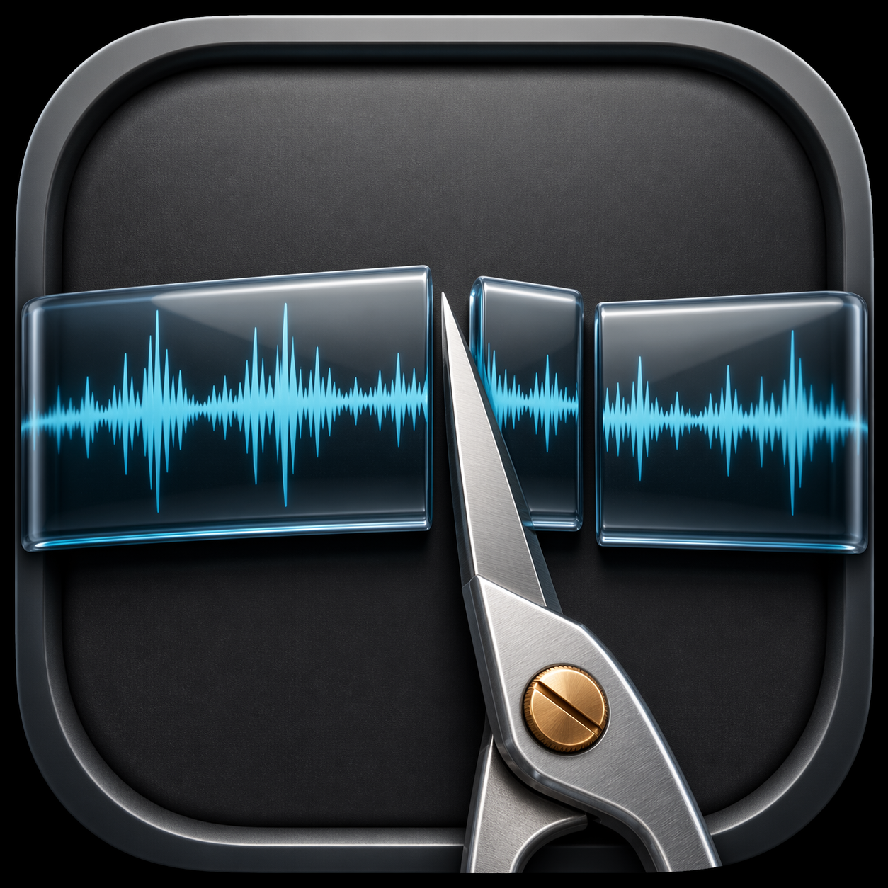
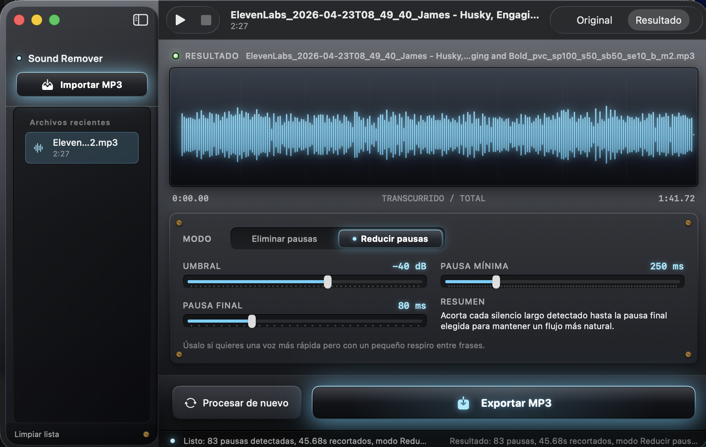

<p align="center">
  
</p>

# Audio Silence Remover

[](LICENSE)
[](https://developer.apple.com/macos/)
[](https://swift.org)

Native **macOS** app that removes or shortens long pauses in spoken-word **MP3** files—entirely on your machine. **Free** on the [Mac App Store](https://apps.apple.com/app/id6763403196), **open source** ([MIT](LICENSE)), and **local-first** (no uploads, no backend).

Built for podcasters, voiceover, and audiobook workflows: import an MP3, tune silence detection, preview on the waveform, and export a cleaned MP3 (default **192 kbps**) without sending audio anywhere.

**Author:** [@fildotai](https://x.com/fildotai) · **Bundle ID:** `com.felipebasurto.audiosilenceremover`



## Highlights

**Swift 6** · **SwiftUI** · **AVFoundation** · App **Sandbox** · bundled **ffmpeg** · **English / Spanish**

- **Two modes** — remove silences entirely, or compress them to a target “breathing” length
- **Waveform preview** with before/after playback
- **Recents** via security-scoped bookmarks (sandbox-safe reopen)
- **No in-app purchases** — processing stays on your Mac

## Get the app

- **[Mac App Store](https://apps.apple.com/app/id6763403196)** — search for **Audio Silence Remover**, or open the listing by Apple ID. If the link does not open yet, the version may still be in review or regional rollout.
- **Build from source** — clone this repo, open `AudioSilenceRemover.xcodeproj`, select the **AudioSilenceRemover** scheme, and run on **My Mac** (see [Build & test](#build--test)).

## How it works

1. **Import** an MP3 (picker or drag-and-drop).
2. **Tune** threshold, minimum silence, and (in reduce mode) final pause length.
3. **Choose** Remove pauses or Reduce pauses, then **Process**.
4. **Preview** Original / Result on the waveform.
5. **Export** a new MP3.

## Known limitations

- **MP3 only** for import and export in the current UI.
- **One file at a time** — no batch queue yet.
- **macOS 15+** on Apple Silicon or Intel.

## Build & test

Requires **macOS 15+** and **Xcode 16+** (Swift 6).

```bash
git clone https://github.com/felipebasurto/silence-remover.git
cd silence-remover
open AudioSilenceRemover.xcodeproj
```

```bash
xcodebuild \
  -project AudioSilenceRemover.xcodeproj \
  -scheme AudioSilenceRemover \
  -configuration Debug \
  -destination "platform=macOS" \
  build
```

```bash
xcodebuild \
  -project AudioSilenceRemover.xcodeproj \
  -scheme AudioSilenceRemover \
  -destination "platform=macOS" \
  test
```

For a signed Release `.app` in `dist/`, see [docs/app-store.md](docs/app-store.md).

## Privacy

Audio is processed locally; nothing is uploaded. Full source is on [GitHub](https://github.com/felipebasurto/silence-remover) for review. Privacy policy: [`docs/privacy-policy.html`](docs/privacy-policy.html).

Diagnostics go to **`trace.log`** (in-app **Copy diagnostics**) and **Console.app** when filtering by bundle ID.

## Contributing

Bugs and ideas: [GitHub Issues](https://github.com/felipebasurto/silence-remover/issues). Security reports: repo **Security** tab. Pull requests welcome for focused fixes.

## More for maintainers

App Store Connect checklists, listing copy, packaging, and signing details: **[docs/app-store.md](docs/app-store.md)**
